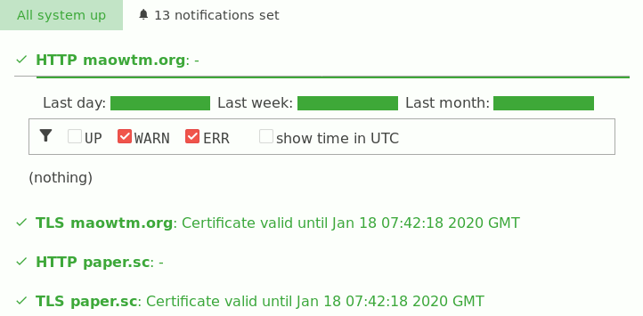

# Serverwatch

[](https://status.maowtm.org)

Simple server monitoring with web notification.

Best suited for:

* Personal / non-critical projects that you still want to make sure it's up.
* Personal email server.

## Features

* Monitor multiple services & list them in one page.
* Log monitoring data in SQLite database.
* Access uptime statistics for the pervious day/week/month from web.
* Access latest (last n minutes) monitoring log from web.
* Comes with code for checking if HTTP server is up, responding with 200 and whether response contains some pre-defined strings.
* Comes with code to check for close-to-expiration / expired TLS certificates.
* Support SMTP STARTTLS for checking email servers.

## Usage

1. Open `web/checks.rs`

2. At the end of the file, find a piece of code like this:
  ```rust
    http_and_tls!(0<<4, "maowtm.org");
    http_and_tls!(1<<4, "paper.sc");
    http_and_tls!(2<<4, "static.maowtm.org");
    http_and_tls!(3<<4, "localhost");
    smtp!(        4<<4, "gmail-smtp-in.l.google.com");
  ```

3. Remove them, and replace with code that check your servers.

   The macro `http_and_tls!` and `smtp!` takes two argument: a unique check id, and the domain to check. Check id can be any number you choose, as long as it is unique for each check. Internally, `http_and_tls!` creates two checks, one with the provided check id, another with the provided check id + 1. Hence I used `n<<4` to ensure that no two checks get assigned the same check id accidentally.

4. `cargo build --features 'web' --release`

5. Run `target/release/web`. This will open a web server as instructed in `web/Rocket.toml`.

## TODOs

* Add more checks
